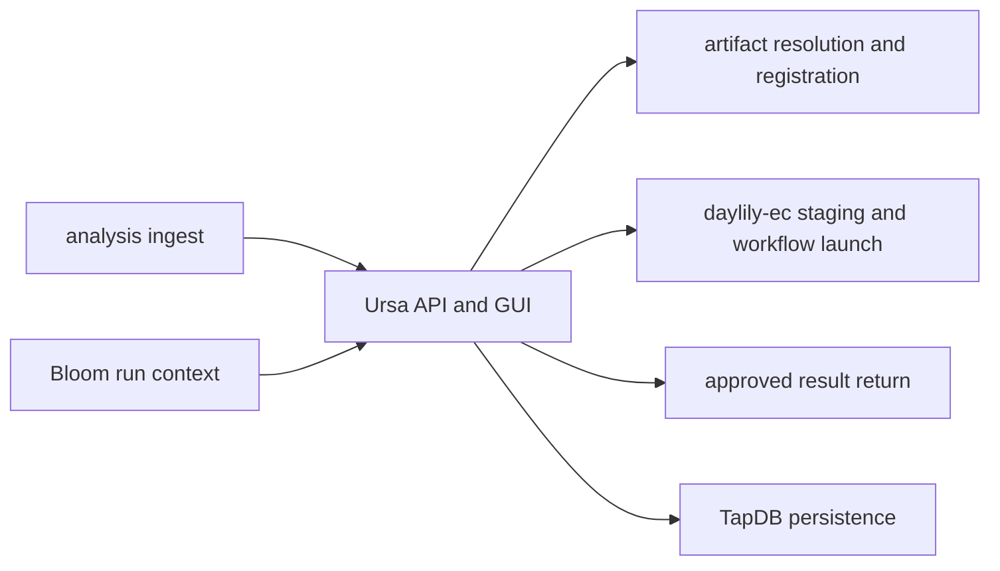

[](https://github.com/Daylily-Informatics/daylily-ursa/releases)
[](https://github.com/Daylily-Informatics/daylily-ursa/tags)
[](https://github.com/Daylily-Informatics/daylily-ursa/actions/workflows/ci.yml)

# daylily-ursa

Daylily Ursa is the analysis execution, review, artifact-linking, and result-return service. It sits downstream of wet-lab execution and upstream of customer-visible delivery, coordinating analysis ingest, staged sample manifests, cluster launch jobs, review state, Dewey artifact linkage, and Atlas return.

Ursa owns:

- analysis ingest records linked to sequencing context
- worksets, manifests, staging jobs, analysis jobs, and review state
- `analysis_samples_manifest` generation from editor inputs, S3 references, and the `daylily-ec` template
- Dewey artifact-link and registration flows for analysis inputs and outputs
- Atlas result return after approval

Ursa does not own:

- customer portal routes
- storage policy authority
- file or file-set identity
- generic shared DB or auth lifecycle

## Current Runtime Contract

The current package and runtime contracts are intentionally pinned:

- `daylily-ephemeral-cluster==2.1.12`
- `daylily-tapdb==6.0.8`
- `daylily-auth-cognito==2.1.5`
- `cli-core-yo==2.1.1`
- `zebra_day==6.0.1`
- Python dependencies live only in `pyproject.toml`
- `environment.yaml` is limited to Python, pip, setuptools, and system/runtime packages

The public CLI is `ursa`, built with a `cli-core-yo` v2 root spec. Several command callbacks still use Typer annotations internally, but command registration, JSON policy, runtime guards, and config/env scaffolding are managed through `cli-core-yo`.

## Component View



## Prerequisites

- Python 3.12+
- Conda shell environment
- local PostgreSQL/TapDB runtime for local development
- configured Cognito values for authenticated GUI startup
- API keys and base URLs for live Bloom, Dewey, or Atlas integration
- Playwright browser binaries for E2E browser flows

## Getting Started

Always activate from the repo root with an explicit deployment name:

```bash
source ./activate <deploy-name>
```

The activation script creates the deployment-scoped conda env only when missing, activates it, and runs one editable install on first create. It does not install extra dependency groups, copy config, export runtime settings, install browser binaries, or run tool checks.

Typical local startup:

```bash
ursa config init
ursa db build --target local
ursa server start --port 8913
```

`ursa server start` uses the shared TLS resolver by default. Pass `--no-ssl` for HTTP-only local testing, or `--cert` and `--key` to use an explicit deployment-scoped certificate pair.

Useful CLI checks:

```bash
ursa --help
ursa --json version
ursa env validate
ursa server --help
ursa server status
```

## Configuration

`ursa config init` creates the deployment-scoped YAML config under the `cli-core-yo` XDG app directory for `ursa-<deploy-name>`. The checked-in example is [config/ursa-config.example.yaml](config/ursa-config.example.yaml).

Important runtime fields:

- `ursa_internal_output_bucket` is required at app startup.
- `tapdb_client_id`, `tapdb_database_name`, `tapdb_config_path`, and `tapdb_env` select the TapDB namespace and runtime.
- Cognito Hosted UI values must be present in YAML for authenticated GUI startup: `cognito_user_pool_id`, `cognito_app_client_id`, `cognito_region`, `cognito_domain`, `cognito_callback_url`, and `cognito_logout_url`.
- `bloom_base_url`, `atlas_base_url`, and Dewey settings control peer-service integrations.
- `ursa_tapdb_mount_enabled` and `ursa_tapdb_mount_path` control the embedded TapDB admin mount.

Use `ursa ...` for Ursa-owned runtime operations. Use `tapdb ...` only where Ursa delegates TapDB lifecycle work, use `daycog ...` only for shared Cognito lifecycle, and use `daylily-ec ...` only for the execution-plane operations Ursa delegates.

## API And Workflow Surface

Core API surface:

- `GET /healthz` and `GET /readyz` expose process readiness.
- `GET /api/v1/me` returns the authenticated user context.
- `/api/v1/analyses` manages analysis ingest, status, review, artifacts, and return.
- `/api/v1/worksets` manages GUI-ready workset records.
- `/api/v1/manifests` creates manifests and writes generated `metadata.analysis_samples_manifest`.
- `/api/v1/manifests/{manifest_euid}/download` returns the generated `analysis_samples.tsv`.
- `/api/v1/staging-jobs` defines and runs sample staging through `daylily-ec samples stage`.
- `/api/v1/analysis-jobs` defines, launches, refreshes, and reads analysis workflow jobs.
- `/api/v1/clusters` and `/api/v1/clusters/jobs` expose cluster creation, inspection, dry-run delete planning, and cluster job state.
- `/api/v1/buckets` manages linked S3 buckets and object browsing/upload helper routes.
- `/api/v1/user-tokens` and `/api/v1/admin/user-tokens` manage Ursa user tokens.

Manifest creation rejects caller-supplied generated manifest metadata. Ursa derives `analysis_samples_manifest` from `editor_analysis_inputs` or S3 input references, using the installed `daylily-ephemeral-cluster==2.1.12` template.

Staging jobs run against an existing manifest and capture the remote FSx stage directory plus stdout/stderr. Analysis jobs may either stage from a `reference_bucket` or reuse a completed `staging_job_euid` whose tenant, workset, manifest, state, and `stage_dir` match the request.

Atlas result return is allowed only after approval. Ursa sends opaque EUIDs and Dewey artifact EUIDs to Atlas and persists the Atlas response on the analysis record.

## TapDB Admin Mount

When enabled, Ursa mounts the TapDB admin ASGI app under `/admin/tapdb`. Mounted mode:

- requires explicit TapDB env and config path
- forwards the Ursa-selected TapDB env, client ID, and namespace into the embedded app
- gates access with `X-API-Key` matching `ursa_internal_api_key`
- injects a mounted TapDB admin identity into the forwarded ASGI scope
- does not mutate TapDB admin auth environment variables
- fails app startup if the mount is enabled but the TapDB admin app cannot be imported

Set `ursa_tapdb_mount_enabled: false` to skip the mount in environments that do not install the TapDB admin surface.

## Development Notes

Useful checks:

```bash
source ./activate <deploy-name>
pytest -q
ruff check .
ruff format --check .
git diff --check
```

Focused contract checks:

```bash
pytest tests/test_activation_metadata.py tests/test_cli_registry_v2.py tests/test_console_scripts.py -q
```

The repo uses setuptools-scm for versions. Release tags are bare numeric semver annotated tags.

## Sandboxing

- Safe: docs work, tests, `ursa --help`, `ursa --json version`, local-only runtime checks
- Local-stateful: `ursa config init` and local TapDB bootstrap paths
- Requires extra care: live Atlas/Bloom/Dewey integrations, cluster lifecycle operations, and deployed environment changes

## Current Docs

- [Docs index](docs/README.md)
- [Google OAuth default](docs/GOOGLE_OAUTH_DEFAULT.md)
- [Ursa-Atlas return contract](docs/ursa_atlas_return_contract.md)
- [TapDB admin mount status](docs/tapdb_mount_execplan.md)
- [Conformance audit](ursa-conformance-directive.md)

## References

- [FastAPI](https://fastapi.tiangolo.com/)
- [TapDB](https://github.com/Daylily-Informatics/daylily-tapdb)
- [Dewey](https://github.com/Daylily-Informatics/dewey)
